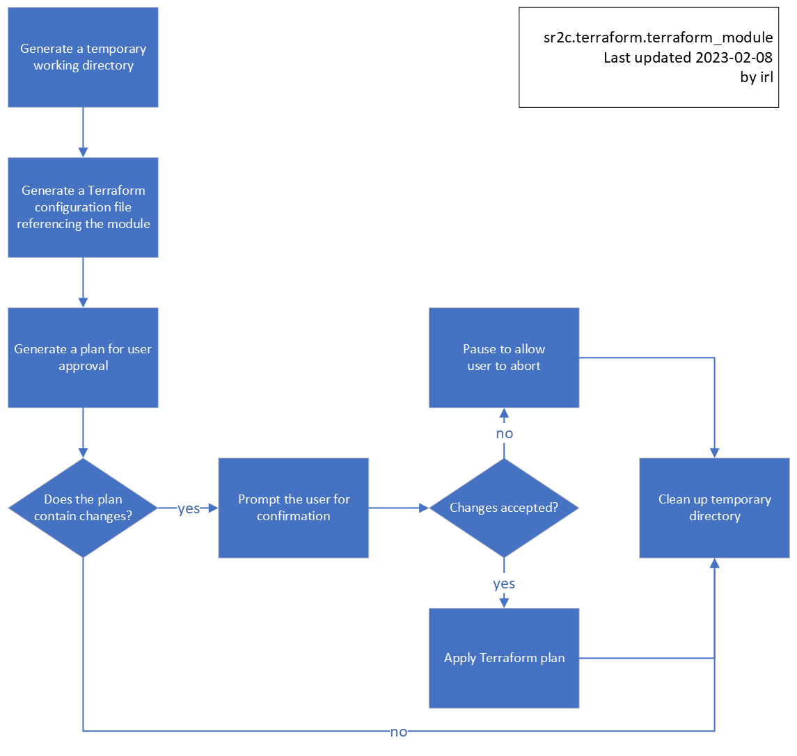

<!-- markdownlint-disable -->
# sr2c.terraform.terraform_module
<!-- markdownlint-restore -->

[![README Header][readme_header_img]][readme_header_link]

[![SR2 Communications Limited][logo]](https://www.sr2.uk/)

<!--


  ** DO NOT EDIT THIS FILE
  **
  ** This file was automatically generated by the `build-harness`.
  ** 1) Make all changes to `README.yaml`
  ** 2) Run `make init` (you only need to do this once)
  ** 3) Run`make readme` to rebuild this file.
  **
  ** (We maintain HUNDREDS of open source projects. This is how we maintain our sanity.)
  **


-->

This role provides the complete steps necessary to deploy cloud resources using Terraform from a given Terraform
module. The module may be available in the local filesystem, via the Terraform registry, or any of the other
[supported module sources](https://developer.hashicorp.com/terraform/language/modules/sources). For modules source
types that support specifying a version, that can also be achieved using this module.

The workflow in this modules tasks are illustrated in the following flowchart:



Either `terraform_module_backend_config` or `terraform_module_workdir` must be set to avoid a situation where
the resources are deployed and the local state in the temporary directory is then immediately deleted leaving the
deployed resources unmanaged.

---


## Usage


The following example creates the necessary resources in AWS to enable the use of an S3 backend (including a
DynamoDB table to facilitate state locking) and then creates a Tor bridge using the
[sr2c/tor-bridge/aws](https://registry.terraform.io/modules/sr2c/tor-bridge/aws/latest) Terraform module. It assumes
that the necessary environment variables to allow AWS authentication have been set where the playbook is to be
executed.

```yaml
---
hosts: all
roles:
  - role: sr2c.terraform.terraform_s3_backend
    vars:
      terraform_state_s3_bucket_name: "my-example-terraform-state"
    delegate_to: localhost
  - role: sr2c.terraform.terraform_module
    vars:
      terraform_module_backend_config:
        s3: "{{ terraform_s3_backend_config | combine({'key': 'aws_base'}) }}"
      terraform_module_source: "sr2c/tor-bridge/aws"
      terraform_module_version: "0.1.0"
      terraform_module_inputs:
        name: "my-example-bridge"
      terraform_module_outputs_var: "terraform_outputs_example"
    delegate_to: localhost
tasks:
  - name: Print out the hashed fingerprint of the deployed bridge
    ansible.builtin.debug:
      var: terraform_outputs_example.hashed_fingerprint
```


<!-- markdownlint-disable -->
## Role Variables

| Variable     | Default Value  | Description  |
| ------------ | -------------- | ------------ |
| terraform_module_backend_config | `{"local" : {}}` | The backend configuration to use. |
| terraform_module_extra | `{}` | A list of extra blocks to add to the Terraform configuration. |
| terraform_module_inputs | `{}` | The inputs to pass to the Terraform module. |
| terraform_module_outputs_var | `"terraform_module_outputs"` | The name of a host variable to store the outputs of the Terraform module. |
| terraform_module_source | **REQUIRED** | The source of the Terraform module to use (either a Terraform registry path, or a relative filesystem path). |
| terraform_module_version | ~ | The version of the Terraform module to use when using a module from the Terraform registry. |
| terraform_module_workdir | ~ | The location where the Terraform files will be templated. By default a temporary directory is created. The location should be an empty directory that already exists. |
| terraform_module_workdir_clean_enabled | `true` | Whether to clean the Terraform module work directory after execution. |
<!-- markdownlint-enable -->
<!-- markdownlint-disable -->
## Makefile Targets
```text
Available targets:

  help                                Help screen
  help/all                            Display help for all targets
  help/short                          This help short screen

```
<!-- markdownlint-restore -->


## Share the Love

Like this project? Please give it a ★ on [our GitLab](https://gitlab.com/https://gitlab.com/sr2c/ansible-terraform)! (it helps us **a lot**)


## Related Projects

Check out these related projects.

- [sr2c.terraform](https://gitlab.com/sr2c/ansible-terraform) - The Ansible collection that this role is part of.
- [sr2c.terraform.terraform_s3_backend](https://gitlab.com/sr2c/ansible-terraform/-/tree/dev/roles/terraform_s3_backend) - An ansible role to deploy the resources a Terraform backend to AWS using S3 and DynamoDB.
- [terraform-null-ansible](https://github.com/cloudposse/terraform-null-ansible) - A CloudPosse Terraform module to run Ansible playbooks.


## References

For additional context, refer to some of these links.

- [community.general.terraform](https://docs.ansible.com/ansible/latest/collections/community/general/terraform_module.html) - Manages a Terraform deployment (and plans)


## Help

**Got a question?** We got answers.

File a GitLab [issue](https://gitlab.com/https://gitlab.com/sr2c/ansible-terraform/-/issues), send us an [email][email] or join our [Matrix Community][matrix].

[![README Commercial Support][readme_commercial_support_img]][readme_commercial_support_link]

## Matrix Community

[][matrix]

Join our [Open Source Community][matrix] on Matrix. It's **FREE** for everyone! This is the best place to talk shop, ask questions, solicit feedback, and work together as a community to build on our open source code.

## Contributing

### Bug Reports & Feature Requests

Please use the [issue tracker](https://gitlab.com/https://gitlab.com/sr2c/ansible-terraform/-/issues) to report any bugs or file feature requests.

### Developing

If you are interested in being a contributor and want to get involved in developing this project or help out with our other projects, we would love to hear from you! Shoot us an [email][email].

In general, PRs are welcome. We follow the typical "fork-and-pull" Git workflow.

 1. **Fork** the repo on GitLab
 2. **Clone** the project to your own machine
 3. **Commit** changes to your own branch
 4. **Push** your work back up to your fork
 5. Submit a **Pull Request** so that we can review your changes

**NOTE:** Be sure to merge the latest changes from "upstream" before making a pull request!


## Copyright

Copyright © 2021-2023 SR2 Communications Limited


## Trademarks

All other trademarks referenced herein are the property of their respective owners.

## About

This project is maintained by [SR2 Communications Limited][website].

[![SR2 Communications Limited][logo]][website]

We're a [DevOps services][website] company based in Aberdeen, Scotland. We ❤️ open source software and
specialise in digital human rights and humanitarian projects.

We offer [paid support][website] on all of our projects.

Check out [our other projects][gitlab], or [hire us][website] to get support with using our projects.

## Trans Rights

![Trans Rights Are Human Rights][trans_rights]

Trans is an umbrella term to describe people whose gender is not the same as, or does not sit comfortably with, the
sex they were assigned at birth. *Like all people*, they have the right to be treated with dignity and respect and to
have their human rights protected.

Transgender people face significant discrimination and prejudice in many areas of their lives, including employment,
education, housing, and healthcare. They are also at increased risk of violence and hate crimes. These issues
can have a serious impact on the physical and mental well-being of transgender people and can prevent them from fully
participating in society.

Transgender rights are therefore an important part of the broader struggle for human rights. Everyone, regardless of
their gender identity, should be able to live their lives free from discrimination and to enjoy the same rights and
opportunities as everyone else. This includes the right to express their gender identity and to be treated with respect
and dignity.

It is important for society to recognize and respect the rights of transgender people, and to take steps to address the
discrimination and prejudice that they face. This can include supporting policies and laws that protect transgender
people from discrimination and promoting acceptance and understanding of transgender people within the broader
community.

* [Gendered Intelligence](https://genderedintelligence.co.uk/) is a trans-led and trans-involving grassroots organisation
  with a wealth of lived experience, community connections of many kinds, and a depth and breadth of trans community
  knowledge. They offer staff training, consultancy, youth work, mentoring and undertake public engagement activities.

* [TransAid Cymru](https://transaid.cymru/) began life as a local mutual aid group in Cardiff. Tired of the ways that the
  electoral political system had let the trans community down, they decided it was time to do something for themselves.
  Many of the founding members were disabled and unemployed. Familiar with the real, material needs of the trans
  community and how little support there was out there, they founded the mutual aid group in order to provide the services
  the trans community needed.

If you have the means and you have benefited from this open source project, please consider making a donation to either
(or both) of the above groups.


## Contributors

<!-- markdownlint-disable -->
|  [![irl][irlxyz_avatar]][irlxyz_homepage]<br/>[irl][irlxyz_homepage] | [![abel][abelxluck_avatar]][abelxluck_homepage]<br/>[abel][abelxluck_homepage] |
|---|---|
<!-- markdownlint-restore -->

  [irlxyz_homepage]: https://gitlab.com/irlxyz
  [irlxyz_avatar]: https://gitlab.com/uploads/-/system/user/avatar/5895869/avatar.png?width=130
  [abelxluck_homepage]: https://gitlab.com/abelxluck
  [abelxluck_avatar]: https://secure.gravatar.com/avatar/0f605397e0ead93a68e1be26dc26481a?s=192&d=identicon


<!-- markdownlint-disable -->
  [logo]: https://www.sr2.uk/readme/logo.png
  [website]: https://www.sr2.uk/?utm_source=gitlab&utm_medium=readme&utm_campaign=https://gitlab.com/sr2c/ansible-terraform&utm_content=website
  [gitlab]: https://www.gitlab.com/sr2c
  [contact]: https://www.sr2.uk/
  [matrix]: https://matrix.to/#/%23dev:sr2.uk
  [linkedin]: https://www.linkedin.com/company/sr2uk/
  [email]: mailto:contact@sr2.uk
  [readme_header_img]: https://www.sr2.uk/readme/paid-support.png
  [readme_header_link]: https://www.sr2.uk/?utm_source=gitlab&utm_medium=readme&utm_campaign=https://gitlab.com/sr2c/ansible-terraform&utm_content=readme_header_link
  [readme_commercial_support_img]: https://www.sr2.uk/readme/paid-support.png
  [readme_commercial_support_link]: https://www.sr2.uk/?utm_source=gitlab&utm_medium=readme&utm_campaign=https://gitlab.com/sr2c/ansible-terraform&utm_content=readme_commercial_support_link
  [trans_rights]: https://img.shields.io/badge/Trans%20Rights-Human%20Rights-lightblue?logo=data:img/png;base64,iVBORw0KGgoAAAANSUhEUgAAABAAAAAQCAIAAACQkWg2AAAAGXRFWHRTb2Z0d2FyZQBBZG9iZSBJbWFnZVJlYWR5ccllPAAAADVJREFUeNpijD73i4EUwMRAIiBZA+PXlTsGm5P+//8/yJzE8m3VzkHmJNL9kKbqNMicBBBgAM3lCr5JiK9jAAAAAElFTkSuQmCC
<!-- markdownlint-restore -->
