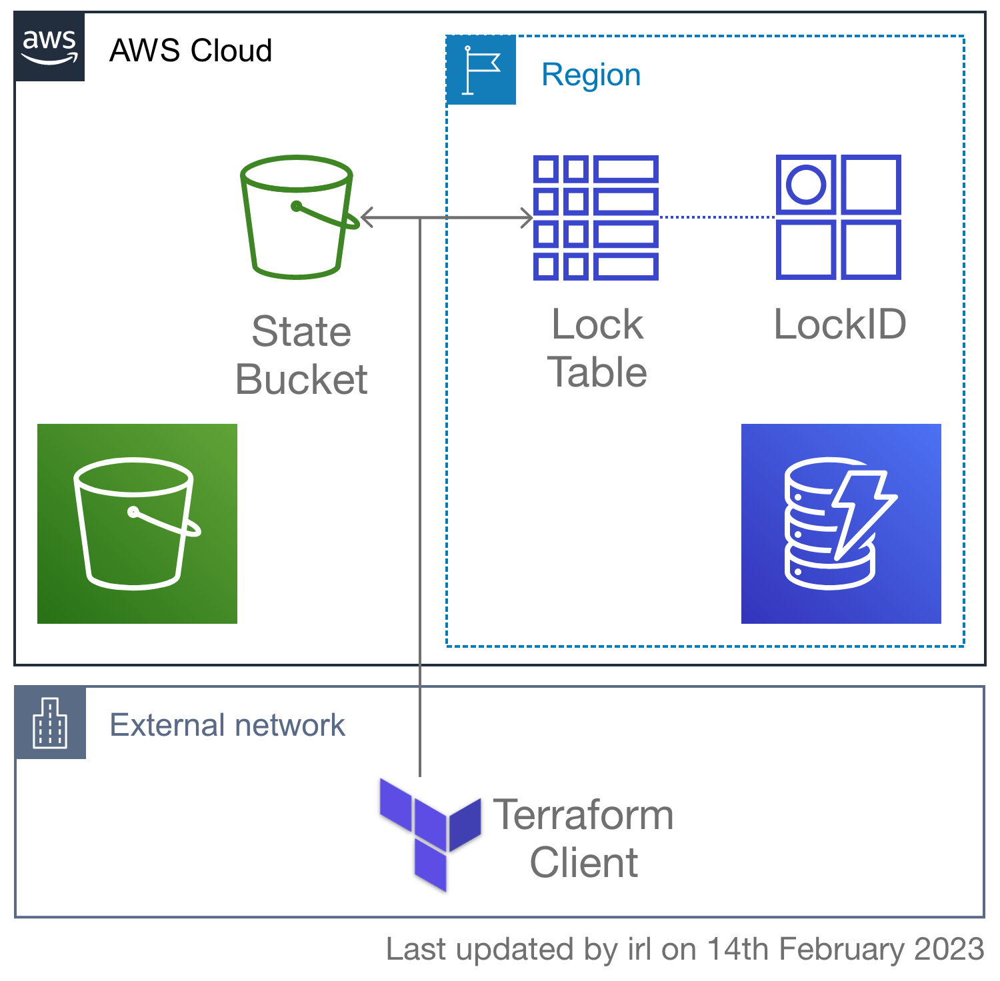

<!-- markdownlint-disable -->
# ansible-terraform-s3-backend
<!-- markdownlint-restore -->

[![README Header][readme_header_img]][readme_header_link]

[![SR2 Communications Limited][logo]](https://www.sr2.uk/)

<!--


  ** DO NOT EDIT THIS FILE
  **
  ** This file was automatically generated by the `build-harness`.
  ** 1) Make all changes to `README.yaml`
  ** 2) Run `make init` (you only need to do this once)
  ** 3) Run`make readme` to rebuild this file.
  **
  ** (We maintain HUNDREDS of open source projects. This is how we maintain our sanity.)
  **


-->

Ansible role to deploy the resources to use S3 for remote Terraform state storage. A DynamoDB table is created to
enable state locking.



**WARNING:** There is an assumption in this module that you'll be deploying the state backend to an AWS account that
you're then also going to deploy infrastructure to and you're likely logged in with an administrator account.
No permissions or IAM roles are configured for accessing the state bucket other than via administrator access. If
you are consolidating your Terraform state across projects into a single AWS account then you'd probably want to
use per-project IAM roles for accessing and modifying state.

---


It's 100% Open Source and licensed under the [BSD 2-clause License](LICENSE).


## Usage


The following example shows how to ensure that the backend has been created, and then use the registered backend
configuration with the terraform_module role. Note the use of the combine filter to add the key to the configuration
to ensure that each module uses its own state object in the S3 bucket.

```yaml
---
hosts: all
roles:
  - role: sr2c.terraform.terraform_s3_backend
    vars:
      terraform_state_s3_bucket_name: "my-example-terraform-state"
    delegate_to: localhost
  - role: sr2c.terraform.terraform_module
    vars:
      terraform_module_backend_config:
        s3: "{{ terraform_s3_backend_config | combine({'key': 'example'}) }}"
      terraform_module_source: "sr2c/tor-bridge/aws"
      terraform_module_version: "0.1.0"
      terraform_module_inputs:
        name: "my-example-bridge"
    delegate_to: localhost
```

To use the created backend directly in Terraform using a Jinja2 template, add a backend configuration block to the
template file:

```hcl
terraform {
  backend "s3" {
    bucket         = "{{ terraform_s3_backend_config['bucket'] }}"
    dynamodb_table = "{{ terraform_s3_backend_config['dynamodb_table'] }}"
    key            = "example"
    region         = "{{ lookup('env', 'AWS_REGION') }}"
  }
}
```


<!-- markdownlint-disable -->
## Role Variables

| Variable     | Default Value  | Description  |
| ------------ | -------------- | ------------ |
| terraform_state_dynamodb_table_name | `{{ terraform_state_s3_bucket_name }}` | Name of the DynamoDB table to create to facilitate state locking. |
| terraform_state_register_config | ``true`` | If true, the configuration will be registered in the `terraform_s3_backend_config` variable. |
| terraform_state_s3_bucket_name | **REQUIRED** | Name of the S3 bucket to create to hold the Terraform state remotely. |
<!-- markdownlint-enable -->
<!-- markdownlint-disable -->
## Makefile Targets
```text
Available targets:

  help                                Help screen
  help/all                            Display help for all targets
  help/short                          This help short screen

```
<!-- markdownlint-restore -->


## Help

**Got a question?** We got answers.

File a GitLab [issue](https://gitlab.com/sr2c/ansible-terraform-s3-backend/-/issues), send us an [email][email] or join our [Matrix Community][matrix].

[![README Commercial Support][readme_commercial_support_img]][readme_commercial_support_link]

## Matrix Community

[][matrix]

Join our [Open Source Community][matrix] on Matrix. It's **FREE** for everyone! This is the best place to talk shop, ask questions, solicit feedback, and work together as a community to build on our open source code.

## Contributing

### Bug Reports & Feature Requests

Please use the [issue tracker](https://gitlab.com/sr2c/ansible-terraform-s3-backend/-/issues) to report any bugs or file feature requests.

### Developing

If you are interested in being a contributor and want to get involved in developing this project or help out with our other projects, we would love to hear from you! Shoot us an [email][email].

In general, PRs are welcome. We follow the typical "fork-and-pull" Git workflow.

 1. **Fork** the repo on GitLab
 2. **Clone** the project to your own machine
 3. **Commit** changes to your own branch
 4. **Push** your work back up to your fork
 5. Submit a **Pull Request** so that we can review your changes

**NOTE:** Be sure to merge the latest changes from "upstream" before making a pull request!


## Copyright

Copyright © 2021-2023 SR2 Communications Limited


## License


```text
Redistribution and use in source and binary forms, with or without modification, are permitted provided that the
following conditions are met:

1. Redistributions of source code must retain the above copyright notice, this list of conditions and the following
   disclaimer.

2. Redistributions in binary form must reproduce the above copyright notice, this list of conditions and the following
   disclaimer in the documentation and/or other materials provided with the distribution.

THIS SOFTWARE IS PROVIDED BY THE COPYRIGHT HOLDERS AND CONTRIBUTORS "AS IS" AND ANY EXPRESS OR IMPLIED WARRANTIES,
INCLUDING, BUT NOT LIMITED TO, THE IMPLIED WARRANTIES OF MERCHANTABILITY AND FITNESS FOR A PARTICULAR PURPOSE ARE
DISCLAIMED. IN NO EVENT SHALL THE COPYRIGHT HOLDER OR CONTRIBUTORS BE LIABLE FOR ANY DIRECT, INDIRECT, INCIDENTAL,
SPECIAL, EXEMPLARY, OR CONSEQUENTIAL DAMAGES (INCLUDING, BUT NOT LIMITED TO, PROCUREMENT OF SUBSTITUTE GOODS OR
SERVICES; LOSS OF USE, DATA, OR PROFITS; OR BUSINESS INTERRUPTION) HOWEVER CAUSED AND ON ANY THEORY OF LIABILITY,
WHETHER IN CONTRACT, STRICT LIABILITY, OR TORT (INCLUDING NEGLIGENCE OR OTHERWISE) ARISING IN ANY WAY OUT OF THE USE
OF THIS SOFTWARE, EVEN IF ADVISED OF THE POSSIBILITY OF SUCH DAMAGE.
```


## Trademarks

All other trademarks referenced herein are the property of their respective owners.

## About

This project is maintained by [SR2 Communications Limited][website].

[![SR2 Communications Limited][logo]][website]

We're a [DevOps services][website] company based in Aberdeen, Scotland. We ❤️ open source software and
specialise in digital human rights and humanitarian projects.

We offer [paid support][website] on all of our projects.

Check out [our other projects][gitlab], or [hire us][website] to get support with using our projects.

## Trans Rights

![Trans Rights Are Human Rights][trans_rights]

Trans is an umbrella term to describe people whose gender is not the same as, or does not sit comfortably with, the
sex they were assigned at birth. *Like all people*, they have the right to be treated with dignity and respect and to
have their human rights protected.

Transgender people face significant discrimination and prejudice in many areas of their lives, including employment,
education, housing, and healthcare. They are also at increased risk of violence and hate crimes. These issues
can have a serious impact on the physical and mental well-being of transgender people and can prevent them from fully
participating in society.

Transgender rights are therefore an important part of the broader struggle for human rights. Everyone, regardless of
their gender identity, should be able to live their lives free from discrimination and to enjoy the same rights and
opportunities as everyone else. This includes the right to express their gender identity and to be treated with respect
and dignity.

It is important for society to recognize and respect the rights of transgender people, and to take steps to address the
discrimination and prejudice that they face. This can include supporting policies and laws that protect transgender
people from discrimination and promoting acceptance and understanding of transgender people within the broader
community.

* [Gendered Intelligence](https://genderedintelligence.co.uk/) is a trans-led and trans-involving grassroots organisation
  with a wealth of lived experience, community connections of many kinds, and a depth and breadth of trans community
  knowledge. They offer staff training, consultancy, youth work, mentoring and undertake public engagement activities.

* [TransAid Cymru](https://transaid.cymru/) began life as a local mutual aid group in Cardiff. Tired of the ways that the
  electoral political system had let the trans community down, they decided it was time to do something for themselves.
  Many of the founding members were disabled and unemployed. Familiar with the real, material needs of the trans
  community and how little support there was out there, they founded the mutual aid group in order to provide the services
  the trans community needed.

If you have the means and you have benefited from this open source project, please consider making a donation to either
(or both) of the above groups.


## Contributors

<!-- markdownlint-disable -->
|  [![irl][irlxyz_avatar]][irlxyz_homepage]<br/>[irl][irlxyz_homepage] |
|---|
<!-- markdownlint-restore -->

  [irlxyz_homepage]: https://gitlab.com/irlxyz
  [irlxyz_avatar]: https://gitlab.com/uploads/-/system/user/avatar/5895869/avatar.png?width=130

<!-- markdownlint-disable -->
  [logo]: https://www.sr2.uk/readme/logo.png
  [website]: https://www.sr2.uk/?utm_source=gitlab&utm_medium=readme&utm_campaign=sr2c/ansible-terraform-s3-backend&utm_content=website
  [gitlab]: https://www.gitlab.com/sr2c
  [contact]: https://www.sr2.uk/
  [matrix]: https://matrix.to/#/%23dev:sr2.uk
  [linkedin]: https://www.linkedin.com/company/sr2uk/
  [email]: mailto:contact@sr2.uk
  [readme_header_img]: https://www.sr2.uk/readme/paid-support.png
  [readme_header_link]: https://www.sr2.uk/?utm_source=gitlab&utm_medium=readme&utm_campaign=sr2c/ansible-terraform-s3-backend&utm_content=readme_header_link
  [readme_commercial_support_img]: https://www.sr2.uk/readme/paid-support.png
  [readme_commercial_support_link]: https://www.sr2.uk/?utm_source=gitlab&utm_medium=readme&utm_campaign=sr2c/ansible-terraform-s3-backend&utm_content=readme_commercial_support_link
  [trans_rights]: https://img.shields.io/badge/Trans%20Rights-Human%20Rights-lightblue?logo=data:img/png;base64,iVBORw0KGgoAAAANSUhEUgAAABAAAAAQCAIAAACQkWg2AAAAGXRFWHRTb2Z0d2FyZQBBZG9iZSBJbWFnZVJlYWR5ccllPAAAADVJREFUeNpijD73i4EUwMRAIiBZA+PXlTsGm5P+//8/yJzE8m3VzkHmJNL9kKbqNMicBBBgAM3lCr5JiK9jAAAAAElFTkSuQmCC
<!-- markdownlint-restore -->
